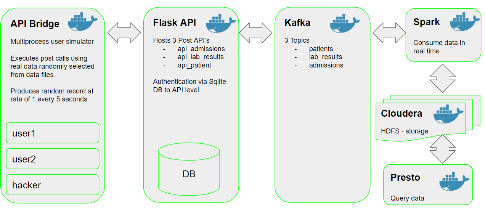
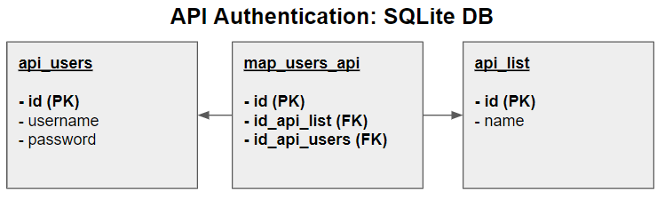

    

  
<strong>Project 3: Understanding User Behavior</strong>

  
<strong>W205: Fundamentals of Data Engineering</strong>

  
<strong>Piotr Parkitny | pparkitny@ischool.berkeley.edu</strong>

  
<strong>Sandip Panesar | sandippanesar@berkeley.edu</strong>

<!-- TABLE OF CONTENTS -->
## Table of Contents

* [Problem Statement](#problem-statement)
* [Presentation](#presentation)
* [Description](#description)
* [Tools Used](#tools-used)
* [Project Solution](#project-solution)

<!-- PROBLEM STATEMENT -->
Problem Statement
------------
- Compiling large, up-to-date, secure and centralized repositories of health records is a major challenge facing medical data science  
- Achieving this will allow advanced ML/DL techniques to be applied to sufficiently large datasets for optimal performance and impact

<!-- presentation -->
Presentation
------------
The final presentation for this project is hosted on google drive with the link here -> [Link to Presentation](https://docs.google.com/presentation/d/14XJVOvAMcqVwZS8CfbtVuPDY5W9vEbOO7hxpSdSlM4s/edit?usp=sharing)

<!-- DESCRIPTION -->
Description
------------

In this project we have designed a system capable of pulling health records from various clinical sources (hospitals, clinics, labs etc.), in real time, capable of processing and storing them in a queryable database. 

The overall design of the pipeline is presented below.

    

<!-- TOOLS USED -->
Tools Used
------------

All the tools used are on GCP

- JupyterLab
- Jupyter Notebook
- Docker
- Zookeeper
- Cloudera
- Spark
- Kafka
- Presto

<!-- PROJECT SOLUTION -->
Project Solution
------------

Solution to the project is split into two sections.

1. Pipeline Creator
2. Code

### Part 1: Pipeline Creator
The Jupyter Notebook contains all the code and results as they relate to starting and running the pipeline.
The following details are included in the notebook.
Please use the following link to open the notebook -> [Jupyter Notebook Part1](Project_3_Part1.ipynb)

- Starting the docker containers using docker-compose
- Installing required python packages for Flask
- Installing required python packages for API-Bridge
- Creating Kafka Topics
- Starting Spark Streaming Jobs
- Checking if the messages are saved to HDFS

### Part 2: Code
The code required to run the pipeline is explained in this section along with links to the files.

#### Data Generator - API Bridge
Custom written app that uses post requests to call Flask API
- 'main.py' that starts the application -> [main.py](API_Bridge/main.py)
- 'Puller_Url.py' that is a separate process and calls the Flask API -> [Puller_Url.py](API_Bridge/Puller_Url.py)
- 'tools.py' general purpose functions used by 'Puller_Url.py' -> [tools.py](API_Bridge/tools.py)

#### Flask - Hosted API
Flask is used to host our API's. It uses a SQLite DB for user authentication.
- 'main.py' that starts the application -> [main.py](Flask/main.py)
- 'api_admissions.py' the admissions api -> [api_admissions.py](Flask/api_admissions.py)
- 'api_lab_results.py' the lab results api -> [api_lab_results.py](Flask/api_lab_results.py)
- 'api_patient.py' the patient api -> [api_patient.py](Flask/api_patient.py)
- 'tools.py' is contains all the general purpose functions used across all the api's -> [tools.py](Flask/tools.py)
- 'config.py' that stores configuration for the application -> [config.py](Flask/config.py)
- 'flask_auth_db.db' SQLite DB that stores user to api authentication mapping -> [flask_auth_db.db](Flask/flask_auth_db.db)

SQLite DB is used to store authentication credentials for each api.
- api_users: table stores username and password
- api_list: table stores api name
- map_users-api: table stores the users to api mapping

    

#### Spark Streaming Jobs
The three spark streaming jobs
- stream_admissions.py -> [stream_admissions.py](Spark/stream_admissions.py)
- stream_lab_results.py -> [stream_lab_results.py](Spark/stream_lab_results.py)
- stream_patients.py -> [stream_patients.py](Spark/stream_patients.py)  

During the creation of the spark jobs we have used a notebook since it was much easier to design and test in an interactive mode.
The Spark job notebook is not used in the pipeline but is included for reference -> [Jupyter Notebook Part2](Project_3_Part2.ipynb)

#### Hive Table Creation Script
The three table creations files that are executed using hive.
- create_admissions_table.sql -> [create_admissions_table.sql](Hive/create_admissions_table.sql)
- create_lab_results_table.sql -> [create_lab_results_table.sql](Hive/create_lab_results_table.sql)
- create_patients_table.sql -> [create_patients_table.sql](Hive/create_patients_table.sql)

